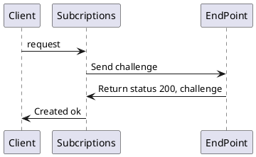

# Điều tra cách Lắng nghe event message từ app slack


  - Tài liệu tham khảo tại 
  - - [Event Subscriptions](https://api.slack.com/apps/A01K257T7GA/event-subscriptions?)
  - - [Using the Slack Events API](https://api.slack.com/apis/connections/events-api)


## Đăng ký các loại sự kiện
- Để bắt đầu làm việc với API sự kiện, bạn cần tạo ứng dụng Slack nếu chưa có.

- Trong khi quản lý ứng dụng của bạn, hãy tìm trang cấu hình **"Event Subscriptions"** và sử dụng nút gạt để "Enable". 

Bạn sẽ có thể chọn tất cả các loại sự kiện mà bạn muốn đăng ký.


- Events API Request URLs

Tất cả event đăng ký đều nhận được một HTTP POST chứa dữ liệu để phản hồi lại hoạt động.

Để đăng ký được Events API Request URLs qua các bước sau :

Bước 1 : Khi nhập đường dẫn redirect_url vào thanh nhập, client gửi request tạo redirect_url với Slack.
Bước 2 : Slack nhận đường link gửi lại cho phía endpoint 1 property trong request là "challenge". Rồi Slack đợi phản hồi từ phía endpoint.
Bước 3 : Phía endpoint kiểm tra trong request có value của challenge , sau đó gửi lại vs status 200 và value của challenge.
Bước 4 : Phía Slack kiểm tra giá trị của Challenge để xác nhận đăng ký thành công hay thất bại.

Hình minh họa luồng:


Hình ảnh khi đăng ký thành công.


Code thực hiện đăng ký redirect url và log các thông báo khi có sự kiện đã đăng ký đến.
```
const challenge = req.body.challenge;
if (challenge) {
    return res.status(200).send(challenge);
}
console.log(req.body.event) 
return res.status(202).send("Ok");

```

## Chọn đăng ký sự kiện
Sau khi định cấu hình và xác thực URL Yêu cầu của bạn, đã đến lúc đăng ký các loại sự kiện hữu ích hoặc cần thiết cho ứng dụng của bạn.


- **Team Events** - đây là những sự kiện yêu cầu phạm vi OAuth tương ứng.

- **Bot Events** - đăng ký các sự kiện thay mặt cho người dùng bot của ứng dụng của bạn.

## Nhận sự kiện
- URL Yêu cầu của bạn sẽ nhận được yêu cầu cho mỗi sự kiện phù hợp với đăng ký . Một yêu cầu, một sự kiện.

- Khi một sự kiện trong đăng ký thì một yêu cầu HTTP POST đến Redirect URL có định dạng sau:


- Các loại sự kiện có thể tham khảo tài liệu tại [https://api.slack.com/events](https://api.slack.com/events)

## Các loại format message Slack gửi lên Bot
### 1. Text
- Slack gửi lên bot với nội dung text là hello myfriend 


- Kết quả lắng nghe được:
```
{
  client_msg_id: 'cf2586a3-2404-4251-90fd-2cee97cf21fc',
  type: 'message',
  text: 'Hello myfriend',
  user: 'U01JH1D7S1L',
  ts: '1611116794.000500',
  team: 'T01K2DCCVPB',
  blocks: [ { type: 'rich_text', block_id: 'V0ZIN', elements: [Array] } ],
  channel: 'D01KERCMB8R',
  event_ts: '1611116794.000500',
  channel_type: 'im'
}
```

### 2. Document

- Slack gửi lên bot với nội dung Document là file Báo-cáo-TTTN.docx 


- Kết quả lắng nghe được:
```
{
  type: 'message',
  text: '',
  files: [
    {
      id: 'F01K7V0RD5G',
      created: 1611118328,
      timestamp: 1611118328,
      name: 'Báo-cáo-TTTN.docx',
      title: 'Báo-cáo-TTTN.docx',
      mimetype: 'application/vnd.openxmlformats-officedocument.wordprocessingml.document',
      filetype: 'docx',
      pretty_type: 'Word Document',
      user: 'U01JH1D7S1L',
      editable: false,
      size: 583922,
      mode: 'hosted',
      is_external: false,
      external_type: '',
      is_public: false,
      public_url_shared: false,
      display_as_bot: false,
      username: '',
      url_private: 'https://files.slack.com/files-pri/T01K2DCCVPB-F01K7V0RD5G/b__o-c__o-tttn.docx',
      url_private_download: 'https://files.slack.com/files-pri/T01K2DCCVPB-F01K7V0RD5G/download/b__o-c__o-tttn.docx',
      converted_pdf: 'https://files.slack.com/files-tmb/T01K2DCCVPB-F01K7V0RD5G-120fbcce4d/b__o-c__o-tttn_converted.pdf',
      thumb_pdf: 'https://files.slack.com/files-tmb/T01K2DCCVPB-F01K7V0RD5G-120fbcce4d/b__o-c__o-tttn_thumb_pdf.png',
      thumb_pdf_w: 935,
      thumb_pdf_h: 1210,
      permalink: 'https://mycom-evl2475.slack.com/files/U01JH1D7S1L/F01K7V0RD5G/b__o-c__o-tttn.docx',
      permalink_public: 'https://slack-files.com/T01K2DCCVPB-F01K7V0RD5G-53d79d58dc',
      has_rich_preview: false
    }
  ],
  upload: false,
  user: 'U01JH1D7S1L',
  display_as_bot: false,
  ts: '1611118335.002600',
  channel: 'D01KERCMB8R',
  subtype: 'file_share',
  event_ts: '1611118335.002600',
  channel_type: 'im'
}
```
### 3. Emotion

- Slack gửi lên bot với nội dung là 1 Emotion 
- 

- Kết quả lắng nghe được:
```
{
  client_msg_id: 'dc3e2aad-71cb-4c3a-935a-d295d5d7d651',
  type: 'message',
  text: ':thumbsup:',
  user: 'U01JH1D7S1L',
  ts: '1611118478.003100',
  team: 'T01K2DCCVPB',
  blocks: [ { type: 'rich_text', block_id: 'ic4w', elements: [Array] } ],
  channel: 'D01KERCMB8R',
  event_ts: '1611118478.003100',
  channel_type: 'im'
}
```

### 4. Text + Emotion

- Slack gửi lên bot với nội dung là Đây là biểu tượng vái =)) emoji 

- Kết quả lắng nghe được:
```
{
  client_msg_id: 'faf85a7f-1f0b-4cb6-9db3-fa0f0c5e1b85',
  type: 'message',
  text: 'Đây là biểu tượng vái =)):pray:',
  user: 'U01JH1D7S1L',
  ts: '1611118592.003600',
  team: 'T01K2DCCVPB',
  blocks: [ { type: 'rich_text', block_id: 'RIm', elements: [Array] } ],
  channel: 'D01KERCMB8R',
  event_ts: '1611118592.003600',
  channel_type: 'im'
}
```

### 5. File image

- Slack gửi lên bot với nội dung là 1  File image


- Kết quả lắng nghe được:
```
{
  type: 'message',
  text: '',
  files: [
    {
      id: 'F01K7VDHCQ2',
      created: 1611118754,
      timestamp: 1611118754,
      name: 'redirectUrl.png',
      title: 'redirectUrl.png',
      mimetype: 'image/png',
      filetype: 'png',
      pretty_type: 'PNG',
      user: 'U01JH1D7S1L',
      editable: false,
      size: 131727,
      mode: 'hosted',
      is_external: false,
      external_type: '',
      is_public: false,
      public_url_shared: false,
      display_as_bot: false,
      username: '',
      url_private: 'https://files.slack.com/files-pri/T01K2DCCVPB-F01K7VDHCQ2/redirecturl.png',
      url_private_download: 'https://files.slack.com/files-pri/T01K2DCCVPB-F01K7VDHCQ2/download/redirecturl.png',
      thumb_360_w: 360,
      thumb_360_h: 235,
      thumb_480: 'https://files.slack.com/files-tmb/T01K2DCCVPB-F01K7VDHCQ2-8ab7a1229a/redirecturl_480.png',
      thumb_480_w: 480,
      thumb_480_h: 313,
      thumb_720: 'https://files.slack.com/files-tmb/T01K2DCCVPB-F01K7VDHCQ2-8ab7a1229a/redirecturl_720.png',
      thumb_720_w: 720,
      thumb_1024: 'https://files.slack.com/files-tmb/T01K2DCCVPB-F01K7VDHCQ2-8ab7a1229a/redirecturl_1024.png',
      thumb_1024_w: 1024,
      thumb_1024_h: 669,
      original_w: 1383,
      original_h: 903,
      thumb_tiny: 'AwAfADDSzSFgP/1Ug+8aU9e9ACg56UUZPr+lIeRgk/hQAtFFFADN6hjlgPxpxPNG0ZziloAQEdx+lLx7UflSHjtQAtFJu9jS0Af/2Q==',
      permalink: 'https://mycom-evl2475.slack.com/files/U01JH1D7S1L/F01K7VDHCQ2/redirecturl.png',
      permalink_public: 'https://slack-files.com/T01K2DCCVPB-F01K7VDHCQ2-1a3d306b4a',
      has_rich_preview: false
    }
  ],
  upload: false,
  user: 'U01JH1D7S1L',
  display_as_bot: false,
  ts: '1611118757.003900',
  channel: 'D01KERCMB8R',
  subtype: 'file_share',
  event_ts: '1611118757.003900',
  channel_type: 'im'
}
```


### 6. Text + Image

- Slack gửi lên bot với nội dung là Text + Image, 

- Kết quả lắng nghe được:
```
{
  type: 'message',
  text: 'Đây là image',
  files: [
    {
      id: 'F01K80424H0',
      created: 1611118864,
      timestamp: 1611118864,
      name: 'redirectUrl.png',
      title: 'redirectUrl.png',
      mimetype: 'image/png',
      filetype: 'png',
      pretty_type: 'PNG',
      user: 'U01JH1D7S1L',
      editable: false,
      size: 131727,
      mode: 'hosted',
      is_external: false,
      external_type: '',
      is_public: false,
      public_url_shared: false,
      display_as_bot: false,
      username: '',
      url_private: 'https://files.slack.com/files-pri/T01K2DCCVPB-F01K80424H0/redirecturl.png',
      url_private_download: 'https://files.slack.com/files-pri/T01K2DCCVPB-F01K80424H0/download/redirecturl.png',
      thumb_800_h: 522,
      thumb_960: 'https://files.slack.com/files-tmb/T01K2DCCVPB-F01K80424H0-3be0a19f21/redirecturl_960.png',
      thumb_960_w: 960,
      thumb_960_h: 627,
      thumb_1024: 'https://files.slack.com/files-tmb/T01K2DCCVPB-F01K80424H0-3be0a19f21/redirecturl_1024.png',
      thumb_1024_w: 1024,
      thumb_1024_h: 669,
      original_w: 1383,
      original_h: 903,
      thumb_tiny: 'AwAfADDSzSFgP/1Ug+8aU9e9ACg56UUZPr+lIeRgk/hQAtFFFADN6hjlgPxpxPNG0ZziloAQEdx+lLx7UflSHjtQAtFJu9jS0Af/2Q==',
      permalink: 'https://mycom-evl2475.slack.com/files/U01JH1D7S1L/F01K80424H0/redirecturl.png',
      permalink_public: 'https://slack-files.com/T01K2DCCVPB-F01K80424H0-1dabd058d2',
      has_rich_preview: false
    }
  ],
  upload: false,
  blocks: [ { type: 'rich_text', block_id: 'dY9', elements: [Array] } ],
  user: 'U01JH1D7S1L',
  display_as_bot: false,
  ts: '1611118874.004300',
  channel: 'D01KERCMB8R',
  subtype: 'file_share',
  event_ts: '1611118874.004300',
  channel_type: 'im'
}
```

### 7. Giphy

- Slack gửi lên bot với nội dung là Giphy.gif 


- Kết quả lắng nghe được:
```
{
  type: 'message',
  text: '',
  files: [
    {
      id: 'F01KLJW14E5',
      created: 1611119083,
      timestamp: 1611119083,
      name: 'giphy.gif',
      title: 'giphy.gif',
      mimetype: 'image/gif',
      filetype: 'gif',
      pretty_type: 'GIF',
      user: 'U01JH1D7S1L',
      editable: false,
      size: 1042781,
      mode: 'hosted',
      is_external: false,
      external_type: '',
      is_public: false,
      public_url_shared: false,
      display_as_bot: false,
      username: '',
      url_private: 'https://files.slack.com/files-pri/T01K2DCCVPB-F01KLJW14E5/giphy.gif',
      url_private_download: 'https://files.slack.com/files-pri/T01K2DCCVPB-F01KLJW14E5/download/giphy.gif',
      thumb_64: 'https://files.slack.com/files-tmb/T01K2DCCVPB-F01KLJW14E5-74b978341e/giphy_64.png',
      thumb_480_gif: 'https://files.slack.com/files-tmb/T01K2DCCVPB-F01KLJW14E5-74b978341e/giphy_480.gif',
      original_w: 270,
      original_h: 480,
      deanimate: 'https://files.slack.com/files-tmb/T01K2DCCVPB-F01KLJW14E5-74b978341e/giphy_deanimate.png',
      deanimate_gif: 'https://files.slack.com/files-tmb/T01K2DCCVPB-F01KLJW14E5-74b978341e/giphy_deanimate_gif.png',
      thumb_tiny: 'AwAwABu8WAUECk3E96aXUuVHUfrULOG3ojfvB0ANIqxO0nyHjPpVYM2PvNUyHKKc596hIIJ4P5UDQ5Iiz+gxVC6AS4ZR2rVByM9azbhQb0gg4JBOPShCZasUZY8OO+cZqwXTP3l/76qsSRETuUE981Fgnk7SfUGgRcU8etU7rC3BYAEYGQfrWkYx2BFQXFsXjJXG7r9aYDPtOQMqKqyMpcnAGanSB2+UZ6c5BFOWwyuWLAntxQI//9k=',
      permalink: 'https://mycom-evl2475.slack.com/files/U01JH1D7S1L/F01KLJW14E5/giphy.gif',
      permalink_public: 'https://slack-files.com/T01K2DCCVPB-F01KLJW14E5-2b575f8d8f',
      has_rich_preview: false
    }
  ],
  upload: false,
  user: 'U01JH1D7S1L',
  display_as_bot: false,
  ts: '1611119087.004500',
  channel: 'D01KERCMB8R',
  subtype: 'file_share',
  event_ts: '1611119087.004500',
  channel_type: 'im'
}
```

### 8. Sticker

- Slack gửi lên bot với nội dung là Đây là Sticker 


- Kết quả lắng nghe được:
```
{
{
  "attachments": [
    {
      "contentType": "image/*",
      "contentUrl": "https://smba.trafficmanager.net/apac/v3/attachments/0-ea-d1-d820c64a9a7da56fff53f97a0f164a59/views/original"
    },
    {
      "contentType": "text/html",
      "content": "<div><div></div>\n</div>"
    }
  ],
  "type": "message",
  "timestamp": "2020-07-25T11:57:16.1789533Z",
  "localTimestamp": "2020-07-25T18:57:16.1789533+07:00",
  "id": "1595678236163",
  "channelId": "msteams",
  "serviceUrl": "https://smba.trafficmanager.net/apac/",
  "from": {
    "id": "29:1Zq3uTyzGICSym8MeI-AwIiIPQlCQOBmjGuQQ7mGtpmp7YJKyCwe01C3_esQvQ0pT4OksgfK3KEfGRdNO4oR7ug",
    "name": "Dev",
    "aadObjectId": "7666fbc1-c647-48ea-9db5-5d0f5af758b8"
  },
  "conversation": {
    "conversationType": "personal",
    "tenantId": "1a3cbc9f-e69a-4ff7-983a-335acbae4de9",
    "id": "a:1wgwIKWCuOmZPZxEpty4jhmAZWRSc47Fp4Pbk9rTsDobmY4uf3S7BO3FUVYRfN2sneHPHFPnKrkA-2cf3-me-und_ogxjr5FwY5l-UiqkPfYDrKrJk99TTV95ZokUGc9i"
  },
  "recipient": {
    "id": "28:6da43f49-f73d-49ce-839b-2db81d8922f9",
    "name": "Teams Check"
  },
  "entities": [
    {
      "locale": "en-US",
      "country": "US",
      "platform": "Mac",
      "type": "clientInfo"
    }
  ],
  "channelData": {
    "tenant": {
      "id": "1a3cbc9f-e69a-4ff7-983a-335acbae4de9"
    }
  },
  "locale": "en-US"
}
}
```
